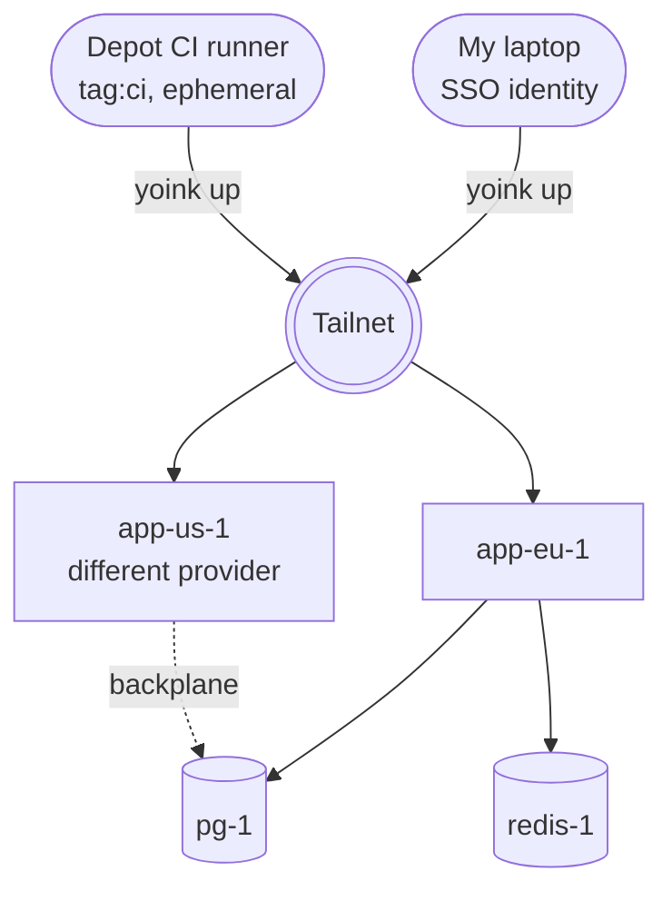

I don't like managing SSH keys. New host, new keypair, paste the pubkey into `authorized_keys`, commit it somewhere, deploy. Six months later I rotate my laptop and have to remember which boxes still trust the old key. Bring up a second host and the dance starts over. The trust list on every machine grows like a junk drawer and nobody is keeping a real inventory.

CI is where this gets actively annoying. CI has to deploy, so CI has a key, and that key is long-lived and machine-held and the most attractive credential in the whole setup. Rotating it is annoying enough that I put it off, and the longer it sits there the worse the eventual cleanup feels.

Yoink does the secret distribution part well. Sealed secrets live in the repo, get decrypted at deploy time from whatever store you point them at, and don't get written to disk in plaintext along the way. That solves the "private key in a GitHub Actions secret" problem cleanly, and for a while I thought that was the answer. But sealed secrets are still secrets, and what I actually wanted was to stop managing the one credential that opens a shell on every host.

## How Tailscale changes it

[Tailscale](https://tailscale.com) is how I got rid of them. Instead of giving every machine a credential I have to track, you give every machine an identity. My laptop is on the tailnet because I logged in with SSO. The host is on the tailnet because I ran `tailscale up` on it once at provisioning. The CI runner is on the tailnet because it auth'd as an ephemeral device for the duration of the job. Tailscale's own keys exist, of course, but they live inside Tailscale and rotate on their own. There's nothing in `authorized_keys` for me to babysit.

The pre-flight on a fresh laptop, in full:

```sh
tailscale up
yoink up --config yoink.yaml
```

Yoink dials the host by its MagicDNS name (`app-eu-1`, say) over the mesh. There is no `~/.ssh/config` entry, no `IdentityFile`, no key file. `sshd` is running on the host but it's bound to the host's tailnet IP only:

```
ListenAddress 100.x.y.z   # the host's tailnet IP
```

Port 22 isn't open on the public IP. The provider firewall blocks it, the host firewall blocks it, and `sshd` isn't listening on it anyway. The constant brute-force noise that used to fill `auth.log` stops, because there's nothing on the public internet to attack.

If I want to retire a device I remove it from the tailnet and it can't reach anything. If I want to rotate CI's auth I rotate the OAuth client and old tokens die on next use. I haven't had to open an `authorized_keys` file since.

## Depot makes the CI side easy

You can wire Tailscale into any CI runner with a `tailscale up` step and an auth key, but it's the kind of glue I'd rather not own. I use [Depot](https://depot.dev/docs/integrations/tailscale) for CI, which has the integration built in. Connect Depot to your tailnet once in organization settings (an OAuth client + a tag, both standard Tailscale primitives) and every runner joins the tailnet for the duration of a job as an ephemeral device, then leaves when the job ends. No bootstrap auth key to inject, no `tailscaled` install step, no leftover secret to rotate later.

Runners come up tagged `tag:ci`, and a single line in my tailnet ACLs grants `tag:ci` SSH access to hosts tagged `tag:prod`. With yoink the deploy step is:

```yaml
- run: yoink up --config yoink.yaml
```

The runner is on the tailnet, the host trusts `tag:ci`, and yoink dials the host by name.

## The backplane

The same tailnet that carries deploy traffic is also a backplane for the services themselves, and that was the point from day one. Keyless SSH falls out of the same setup, but the reason I went looking for this in the first place was to stop treating cross-host networking as its own project.

Suppose I want a second host in another region. Call it `app-us-1`, on a different provider. Normally that's real work: VPC peering, transit gateways, route tables, a bastion, egress costs, a meeting about who owns the bill. With Tailscale it's `tailscale up` on the new box. Both hosts are now on the same flat, authenticated network, and if `app-eu-1` needs to talk to a Postgres replica on `app-us-1` it just dials `app-us-1:5432`. The traffic is encrypted, both endpoints are authenticated, and neither side has anything listening on the public internet.

It also means I don't have to keep cramming everything onto one box just to keep the wiring sane. I can put Postgres on a host with fast disk, Redis on a smaller memory-optimized one, and the app on a third sized for CPU. Each is a yoink target on the same tailnet, and the app dials `pg-1:5432` and `redis-1:6379` by name. None of the datastores need a public IP. Splitting services across hosts stops being a networking project, so I actually do it.

The same tailnet ACLs that gate SSH also gate this east-west traffic. A few lines say only `tag:app` can reach `pg-1:5432`, only `tag:app` can reach `redis-1:6379`, and the app hosts can't reach each other on anything other than the ports they actually need. The network looks flat from the outside but behaves closer to per-service security groups, without the cloud-console clicking that normally gets you there.

This works across providers and across continents, and it works for the box in my closet. Provider compromise stops being load-bearing for network trust, because the provider isn't in the trust path anymore. Trust now concentrates in two places: my SSO and Tailscale's coordination plane. That's a real tradeoff rather than a free win, because phishing my SSO gets an attacker the same access I have. The bet I'm making is that those two are easier to defend well than a fleet of `authorized_keys` files I'd otherwise be re-pasting by hand.

## How it fits together



Identity at the top, tailnet in the middle, hosts at the bottom. Nothing in this picture has a public listener for SSH, and nothing relies on a static key.

## Why the two together

The split between the two tools is clean. Yoink owns the orchestration and leans on Tailscale for identity, so neither has to grow features to cover the other's territory. Sealed secrets still earn their keep for the things that actually need to be secrets, but the credential that used to sit at the center of the whole pipeline isn't part of the daily story anymore. Most of why I like the combination is that it takes a class of fiddly, low-grade headache off the table.
