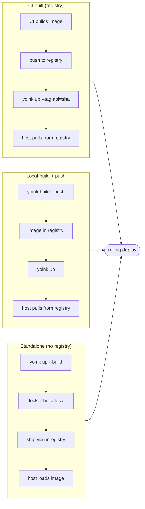

Yoink treats **where the image is built** and **how it gets to the host** as independent choices. Both axes are first-class — pick the combination that fits, mix per-service or per-environment.

**Build origin:**
- **In CI.** GitHub Actions / GitLab / etc. builds and tags the image on every merge. Operator config has no `build:` block — yoink just pulls and rolls. Fits production with an existing CI/CD pipeline.
- **On the operator's machine.** A `build:` block on the service tells yoink to run `docker build` locally before deploying. Same `yoink up` flow either way; a config can mix CI-built infrastructure (`caddy`, `redis`) with locally-built app code. Fits indie / one-person teams and rapid local iteration.

**Distribution:**
- **Via a container registry.** The standard path: `docker push` to a registry (real, self-hosted, or pull-through), `docker pull` from each host. Registry-protocol dedup means only changed layers cross the wire. Fits multi-host production, audit, and tag-based rollback.
- **Direct to host, no registry.** Plain `yoink up` ships any service with a `build:` block straight from the operator's docker daemon to each host over SSH — no registry needed for those services. By default this uses an ephemeral [unregistry](https://github.com/psviderski/unregistry) sidecar so you still get layer-level dedup — only the changed blobs cross the wire on redeploy. Fits rapid iteration, hobby/indie/prototype hosts, and air-gapped environments where opening a registry is overkill.

| Build origin → / Distribution ↓ | In CI | On operator's machine |
|---|---|---|
| **Via registry** | CI pushes, hosts pull. The default for production. | `yoink build --push` then `yoink up` — the classic two-step build+deploy. |
| **Direct to host (no registry)** | Less common, but valid: CI builds then runs `yoink up --transport=unregistry --tag api=<sha>` on a config whose service has a `build:` block (or pass `--no-registry` to force local shipping for non-build services too). | `yoink up --build`, one command. The standalone loop. |

The four cells share a deploy engine — drift detection, healthcheck-gated rolling swap, dependency-ordered waves work the same regardless of how the image arrived. Mixed configs (some services pull from a registry, others ship from local) work out of the box: yoink detects which is which from the `build:` blocks and runs both paths in parallel under a single `yoink up`.



## CI-built — the default

Operator config has no `build:` block; CI builds the image and pushes it to a registry on every merge. `yoink up` pulls and rolls. The image reference is fully qualified (`image: ghcr.io/you/api`) and the tag typically gets overridden at deploy time via `--tag api=<sha>`.

## Local-build (push-then-deploy)

```yaml
services:
  - name: api
    image: ghcr.io/you/api          # real registry path
    tag: dev
    build:
      context: .
      dockerfile: Dockerfile
      args:
        RUST_VERSION: "1.95"
    run:
      port: 8080
```

```sh
docker login ghcr.io                 # one-time
yoink build api --push               # docker build → docker push ghcr.io/you/api:dev
yoink up --service api               # docker pull on each host → rolling swap
```

`yoink build --push` runs `docker build` against your local docker daemon, tagging as `<image>:<tag>` (which equals the registry path because of how `image:` is configured), then runs `docker push`. After that the standard deploy path takes over.

Two-step instead of one-shot is deliberate: `yoink build && yoink up` keeps the two phases separate so you can build without pushing (for your own CI), push without rebuilding (for re-tagging), or run the steps on different machines (build on a beefy laptop, deploy from a thin runner).

## Standalone (no registry)

Drop a `yoink.yaml` next to your `Dockerfile`, run `yoink up --build`. Build, ship, run — one command, no CI to set up, no registry account, no auth dance. The default transport is [unregistry](https://github.com/psviderski/unregistry), giving you layer-level dedup over SSH; a tarball fallback handles air-gapped hosts.

For the operator-side commands and the transport details, see [Standalone (no-registry) deploys](/docs/how-to/standalone-mode).

For the middle ground — your own registry without paying for one — see [Self-hosted registry on a yoink host](/docs/how-to/self-hosted-registry).

## See also

- [Standalone (no-registry) deploys](/docs/how-to/standalone-mode) — the operator-side walkthrough.
- [Self-hosted registry on a yoink host](/docs/how-to/self-hosted-registry) — registry without paying for one.
- [Edit-save-deploy with `--watch`](/docs/how-to/watch-mode) — pair with standalone for the tightest iteration loop.
- [Configuration: `build:` block](/docs/reference/config) — full schema for the build origin side.
