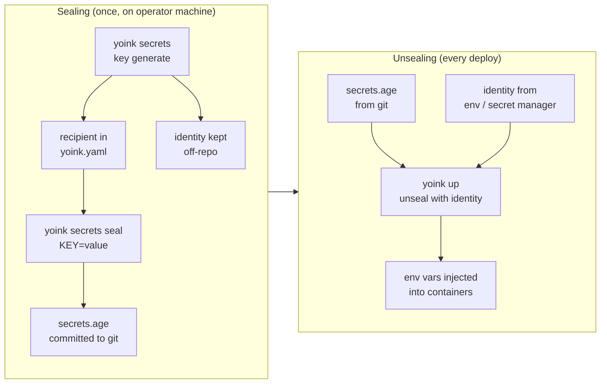

Two providers, one mental model: a key→value bundle resolved at deploy time and injected as env vars into the containers that reference it. The default (`provider: age`) seals the bundle into a file you commit to git; the escape hatch (`provider: command`) shells out to whatever secret manager you already run.

Either way, **the resolved values feed into [`yoink.spec_hash`](/docs/guide/architecture#drift-detection)** — rotating a secret triggers a redeploy, exactly like a config change.



<Callout type="info">
**Looking for the operator-side commands?** This page is the mental model — the *why*. The hands-on workflow (generate a keypair, seal values, consume them, rotate) lives in the [Sealed secrets workflow](/docs/how-to/sealed-secrets-workflow) recipe.
</Callout>

## Sealed secrets (age) — the default

age uses an **asymmetric keypair**, the same shape SSH and GPG use. One `yoink secrets key generate` prints two things at once — they are *not* interchangeable, and where each one belongs is the whole mental model:

| | What it looks like | Where it lives | What it can do |
|---|---|---|---|
| **Recipient** (public half) | `age1w8jcq22re378p38…` | `secrets.recipients:` in `yoink.yaml`, committed to git | **Seal** new values into `secrets.age`. Cannot decrypt. |
| **Identity** (private half) | `AGE-SECRET-KEY-1QQPQZ…` | Your secret manager (GitHub Actions secret, 1Password, AWS SM, …); surfaces at deploy time as `YOINK_AGE_KEY` | **Unseal** existing values. Also seals. Never commit. |

The asymmetry is what makes this safe to commit: the file in your repo is sealed against the public recipient, so anyone reading the repo (collaborators, leaked clone, mirrored backup) sees ciphertext only. Decrypting requires the private identity, which never lands in git.

A few consequences worth internalizing:

- **Sealing only needs the recipient.** `yoink secrets edit` / `seal` work without `YOINK_AGE_KEY` if you're only *adding* values (you'd then need the identity to view existing ones, since `edit` round-trips through decrypt-edit-reseal). The encrypt-only operator is a coherent role — useful for "junior engineer can submit a new secret via PR; only the on-call can read what's already there."
- **Multiple recipients = multiple readers.** `secrets.recipients:` is a list, not a single value. Each recipient is an independent decryption identity — sealing against `[recipient_a, recipient_b]` produces a single file that *either* identity can decrypt. That's how rotation works (transition state with both old and new recipients), and how multi-operator setups work (each engineer's age key is a recipient).
- **`yoink secrets key public`** re-derives the recipient from whichever identity yoink would use right now — handy "is the key in my shell the same one `yoink.yaml` expects?" sanity check.
- **Recovering a recipient from an identity is trivial; the reverse is impossible.** If you lose the recipient string but still have the identity, `yoink secrets key public` regenerates it. If you lose the identity, every value sealed against it is unrecoverable. Plan backups around the identity.

> **Want to try before touching real config?** The [`examples/sealed-secrets/`](https://github.com/oddur/yoink/tree/main/examples/sealed-secrets) walkthrough exercises every step end-to-end against your laptop's docker daemon — no ssh, no registry.

## Threat model

What sealed secrets cover:

- **Repo / git history exposure.** Anyone with read access to the repo (collaborators, mirrors, leaked clone tarballs, future Dependabot bots) sees only ciphertext; without a matching age identity they can't recover values.
- **Backup blast radius.** The repo backups, the CI artifact cache, the dropped laptop with a checkout — none of those leak secrets so long as the age identity isn't co-located.

What they do **not** cover:

- **A compromised `YOINK_AGE_KEY`.** The key holder *is* the trust anchor. If a CI runner is breached, an operator's laptop is stolen unlocked, or `YOINK_AGE_KEY` shows up in a pasted-into-Slack workflow log, every value sealed against that recipient is exposed. Plan rotation accordingly — the [Compromised key](/docs/how-to/sealed-secrets-workflow#compromised-key--emergency-rotation) section of the workflow recipe covers the cleanup.
- **Runtime exposure on the host.** Once decrypted, values land in container env vars. Anyone with `docker exec` or `docker inspect` against the running daemon can read them. Yoink's host model assumes the docker socket is already privileged — it's not a sandbox boundary.
- **Audit trail of which value got read by whom.** age has none. Sealed values are committed once; from then on every operator with the identity decrypts silently. Reach for `provider: command` against a managed store (Vault, Doppler, AWS SM) when "who looked at this and when" needs to be answerable.
- **Per-key git diffs.** The whole `secrets.age` file changes on every edit, so PR review can't show "which key moved." `provider: command` with [sops](#sops) keeps key names plaintext and only encrypts values for that case.

## Identity resolution

When yoink needs to decrypt, it tries these sources in order and stops at the first match:

| Order | Source | When it's used |
|---|---|---|
| 1 | `YOINK_AGE_KEY` env (raw key) | CI / managed-env contexts |
| 2 | `YOINK_AGE_KEY_FILE` env (path) | Explicit override |
| 3 | `~/.config/yoink/keys/*.key` | Laptop default — yoink scans the dir and picks whichever key's public half matches one of `yoink.yaml`'s `secrets.recipients:` |
| 4 | `~/.config/yoink/age.key` | Legacy single-key path; still loaded for back-compat |

The keys-dir scan is what makes multiple projects work without per-project env-var setup. `yoink secrets key generate` writes there by default, and the right project's key gets picked automatically based on the loaded `yoink.yaml`.

Run `yoink secrets key public` from inside any project for a "what key is yoink using here?" sanity check — it prints the recipient derived from whichever identity resolved.

## When age isn't enough

Switch to `provider: command` (next section) when you need:

- **Per-key git diffs** instead of opaque-blob churn — use [sops](#sops). Same "sealed file in the repo" model, but only values are encrypted, so PR review shows which key moved.
- **Cloud KMS as the root of trust** (AWS / GCP / Azure / Vault transit) so no private key ever lives on operator laptops — sops covers this too.
- **Centralized rotation across many repos** — Doppler, 1Password, the Infisical CLI.
- **An audit trail of who read which value when** — Doppler, Vault, AWS Secrets Manager.
- **Fine-grained ACLs** (per-team, per-environment) — Vault, AWS SM, sops with KMS.
- **Secrets that must NOT live in a git history** (regulatory) — anything that's a managed service.

---

## External secrets via CLI (`provider: command`)

`provider: command` is yoink's bring-your-own-tool secrets path. Yoink invokes the configured command, reads the resulting bundle from stdout, and feeds it to the same machinery that `provider: age` uses. No first-party integrations to maintain, no SDK to vendor — operators wire whatever secret store they already run.

```yaml
secrets:
  provider: command
  command: ["doppler", "secrets", "download", "--no-file", "--format", "env"]
```

Yoink spawns that command once per `yoink up` (and once on TUI startup), reads stdout, and parses it. Format is auto-detected: stdout starting with `{` is parsed as JSON, anything else as dotenv (`KEY=value\n`). Override with `format: dotenv` or `format: json` if a value legitimately starts with `{` and confuses the heuristic.

```yaml
secrets:
  provider: command
  command: [...]
  format: dotenv     # or `json`; `auto` is the default
```

Stderr is captured and surfaced when the command exits non-zero. No shell interpolation — yoink spawns the binary directly with the supplied argv (no `sh -c`). If you need pipes or env-var expansion, wrap the call in a shell script and point yoink at that.

### Constraints worth knowing

- **Stdout must be bundle-shaped.** Anything printed to stdout is parsed as the secrets bundle — no progress bars, no `Logging in…` banners, no `set -x` traces. Print diagnostics to stderr (`>&2`). Yoink caps stdout at 10 MB and the call at 60 s wall-clock.
- **The spawn environment is allowlisted.** Yoink forwards only `PATH`, `HOME`, `USER`, `XDG_CONFIG_HOME`, `LANG`, `LC_ALL`, `TERM`, `TZ`, plus per-tool auth tokens (`DOPPLER_TOKEN`, `INFISICAL_TOKEN`, `OP_SERVICE_ACCOUNT_TOKEN`, `VAULT_ADDR`/`VAULT_TOKEN`, `AWS_*`, `AZURE_*`, `GOOGLE_APPLICATION_CREDENTIALS`, `BWS_ACCESS_TOKEN`, `SOPS_AGE_KEY`/`SOPS_AGE_KEY_FILE`). `YOINK_AGE_KEY` is **not** forwarded. Other env vars need a wrapper script that re-exports them.
- **All allowlisted tokens flow to any provider you invoke.** If both `SOPS_AGE_KEY` and `DOPPLER_TOKEN` are in the shell, both reach the spawned command regardless of which provider it is. Run yoink in an env-scrubbed wrapper if that's not acceptable.
- **`secrets.file:` rejects `..` and absolute paths but does not follow symlinks.** A committed sealed file that is a symlink: on read, age-decrypt fails on the target's bytes; on write, `rename(2)` replaces the symlink, leaving the original target untouched. Don't commit symlinked sealed files — that's a PR-review concern, not yoink's.

### sops

[sops](https://github.com/getsops/sops) is the most natural fit for teams that want sealed secrets in the repo (like the `provider: age` default) but with the extra capabilities sops layers on top:

- **Per-key git diffs.** sops encrypts only values; key names stay plaintext. PR review of a secret change shows *which key* moved instead of "this opaque blob changed".
- **Multi-cloud KMS as the root of trust.** Encrypt to AWS KMS, GCP KMS, Azure Key Vault, or Vault transit — decrypt via IAM role at deploy time, no private key on operator laptops.
- **Per-value MAC** for tamper detection at the field level.
- **Granular rotation.** `sops updatekeys` re-keys the data key without re-encrypting every value.
- **Format flexibility.** Encrypts YAML / JSON / INI / dotenv / binary; supports nested structures.

```yaml
secrets:
  provider: command
  command: ["sops", "-d", "--output-type=dotenv", "secrets.enc.yaml"]
```

Pre-flight: `brew install sops` on the operator's laptop and CI runner; configure `.sops.yaml` with the encryption recipients (age key, KMS ARN, etc.). Editor flow stays on `sops edit secrets.enc.yaml` (yoink doesn't wrap it).

Trade-off vs the bundled `provider: age`: sops is one extra binary to install, one extra `.sops.yaml` config to maintain, and (with cloud KMS) a network dependency at deploy time. Reach for sops when one of the bullets above is genuinely paying for that overhead — git-diff legibility for many secret reviewers, or KMS as the root of trust for compliance reasons. The `provider: age` default is sized for "small team, single source-of-truth repo, one private key per environment".

> **Cloud-KMS-backed sops makes the deploy network-dependent and IAM-dependent.** A `sops -d` against AWS/GCP/Azure KMS calls out to the cloud control plane on every invocation — if the runner can't reach the KMS endpoint (DNS hiccup, VPC route flap, IAM role expired, KMS key disabled mid-rotation), the deploy fails at the secrets step and yoink can't recover. Build for that: alarm on KMS request failures, keep the IAM role attached to the runner narrow but durable (don't tie it to a session that expires under deploys), and have a break-glass plan (a sealed `secrets.age` mirror, or a static export rotated quarterly) for the case where KMS is the outage. The `provider: age` default has none of these network failure modes — the sealed file is local and `YOINK_AGE_KEY` is just a string.

### Doppler

```yaml
secrets:
  provider: command
  command: ["doppler", "secrets", "download", "--no-file", "--format", "env"]
```

CI: `DOPPLER_TOKEN` env var with a service-token scoped to the right config. No `doppler login` needed on the runner.

### Infisical CLI

```yaml
secrets:
  provider: command
  command:
    - infisical
    - export
    - --env=prod
    - --projectId=YOUR_PROJECT_ID
    - --format=dotenv
```

Auth: `INFISICAL_TOKEN` (machine identity) or a logged-in `infisical login` session. Self-hosted instances: pass `--domain=https://infisical.your.domain` in the argv.

PEM certs and private keys round-trip cleanly — Infisical's dotenv emitter wraps them in single quotes spanning multiple lines, and yoink's dotenv parser handles that shape natively. No wrapper script needed.

### HashiCorp Vault

```yaml
secrets:
  provider: command
  command: ["sh", "-c", "vault kv get -format=json -field=data secret/yoink/prod"]
  format: json
```

Vault's flat KV path → JSON object on stdout. Auth: `VAULT_ADDR` + `VAULT_TOKEN` (or AWS / OIDC roles). The `sh -c` wrapper is needed because we want vault's `-field=data` extracted and re-emitted; if your Vault path already returns a plain `{"K":"V"}` object, drop the wrapper.

### AWS Secrets Manager

```yaml
secrets:
  provider: command
  command:
    - sh
    - -c
    - "aws secretsmanager get-secret-value --secret-id yoink/prod --query SecretString --output text"
  format: auto
```

Store the value as either a JSON object (`{"DB_URL":"...","API_KEY":"..."}`) or a dotenv blob in the SecretString. Auth via the runner's IAM role.

### 1Password

1Password is structured items, not a flat namespace, so the cleanest fit is a small wrapper script that emits dotenv:

```sh
# bin/yoink-secrets.sh — operator-owned, gitignored alongside yoink.yaml
#!/usr/bin/env bash
set -euo pipefail
op read "op://Engineering/yoink-prod/DATABASE_URL"        | sed 's/^/DATABASE_URL=/'
op read "op://Engineering/yoink-prod/JWT_SIGNING_KEY"     | sed 's/^/JWT_SIGNING_KEY=/'
op read "op://Engineering/yoink-prod/STRIPE_SECRET_KEY"   | sed 's/^/STRIPE_SECRET_KEY=/'
```

```yaml
secrets:
  provider: command
  command: ["./bin/yoink-secrets.sh"]
```

Or `op inject` against a template:

```sh
# secrets.tpl
DATABASE_URL={{ op://Engineering/yoink-prod/DATABASE_URL }}
JWT_SIGNING_KEY={{ op://Engineering/yoink-prod/JWT_SIGNING_KEY }}
```

```yaml
secrets:
  provider: command
  command: ["op", "inject", "-i", "secrets.tpl"]
```

CI: `OP_SERVICE_ACCOUNT_TOKEN` env var with a 1Password service account.

### Bitwarden

```yaml
secrets:
  provider: command
  command: ["bws", "secret", "list", "PROJECT_UUID", "--output", "env"]
```

Auth: `BWS_ACCESS_TOKEN`.

### A static dotenv file (for local development)

```yaml
secrets:
  provider: command
  command: ["cat", ".env.local"]
```

Useful when you want the same `provider: command` schema in both prod (managed) and local (a plain file). Add `.env.local` to `.gitignore`.

### Layered: command on top of age

Yoink doesn't natively merge providers, but the wrapper trick gets you there:

```sh
# bin/yoink-secrets.sh
yoink secrets show --reveal              # age-decrypted dotenv (committed)
op inject -i ops-overrides.tpl           # 1Password-managed runtime tweaks
```

```yaml
secrets:
  provider: command
  command: ["./bin/yoink-secrets.sh"]
```

Later lines override earlier ones (the dotenv parser is last-write-wins per key).

## Format reference

**dotenv** (default for stdout that doesn't start with `{`):

```dotenv
# comments and blank lines OK
KEY=value
QUOTED="value with spaces"
SINGLE_QUOTED='value'
export PREFIX_OK=true     # leading `export ` stripped

# Quoted values may span multiple lines — useful for PEM certs and
# private keys, which is what `infisical export --format=dotenv`,
# `doppler secrets download --format env`, and shell `set` emit
# without you having to do anything.
TLS_CERT='-----BEGIN CERTIFICATE-----
MIIErDCCA5SgAwIBAgIUd...
-----END CERTIFICATE-----'
```

A UTF-8 BOM at the start (`\xEF\xBB\xBF`) is silently stripped — Windows tooling sometimes emits one.

**JSON** (stdout starting with `{`):

```json
{"KEY":"value","QUOTED":"value with spaces","NESTED_NULL_DROPPED":null}
```

Top-level must be an object of `string → string` pairs. `null` values are dropped. **Non-string scalars (numbers, booleans) and nested objects/arrays are a hard error** — silently stringifying `8080` to `"8080"` or `true` to `"true"` masks operator typos and produces values consumers don't expect. If you genuinely need a numeric or boolean secret, emit it as a JSON string at the source.

A malformed bundle is a hard error — yoink would rather fail loud than silently drop a typo'd export.

## See also

- [Sealed secrets workflow](/docs/how-to/sealed-secrets-workflow) — operator-facing tasks: generate identity, seal values, consume them, multi-env, backup, rotation.
- [AGE secrets in GitHub Actions](/docs/how-to/age-in-github-actions) — short recipe for the CI-side wiring.
- [Configuration reference: secrets](/docs/reference/config) — full schema for both providers.
