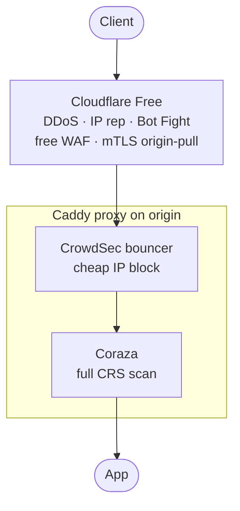

A no-license-fee defense-in-depth stack for public-facing services: Cloudflare Free at the edge with Origin Certs locking the origin to Cloudflare's IPs, [CrowdSec](https://www.crowdsec.net/) for behavioural log-based bans at the proxy, and [Coraza](https://www.coraza.io/) for signature-based payload inspection. Each layer earns its place by doing something the others can't.

This isn't a yoink default. It requires plugins, secrets, a CrowdSec sidecar, and (most importantly) ongoing security operations: tuning OWASP CRS false positives, authoring CrowdSec scenarios, and reading audit logs. Yoink collapses the *deploy* into a single config file; the security engineering is on you.

## Architecture



What each layer brings:

- **Cloudflare Free + Origin Certs**: DDoS absorption, implicit IP-reputation filtering across millions of zones, Bot Fight Mode, and the Cloudflare Free Managed Ruleset (curated subset focused on high-profile/emergency CVEs like Log4j and Shellshock). Pair with a Cloudflare Origin Certificate and `client_auth: require_and_verify` to lock your origin so it only TLS-terminates for connections presenting a Cloudflare-signed client cert; leaked origin IPs become useless. See the [Origin Certs recipe](/docs/how-to/cloudflare-origin-certs) for the dashboard step. Limits: 1 MB request-body inspection cap; broader managed rules and OWASP CRS at the edge are Pro+.
- **CrowdSec + caddy-crowdsec-bouncer**: log-based behavioural detection. The CrowdSec agent reads your Caddy/app logs for failed logins, 404 scanning, brute force, path traversal probes, and emits decisions specific to *your* traffic. The bouncer enforces them at the proxy, microseconds per request. Plus a crowdsourced blocklist from the global CrowdSec community.
- **Coraza**: drop-in ModSecurity replacement with the full OWASP Core Rule Set (PL1–PL4). Signature-based payload inspection; scans request bodies, headers, and URLs against thousands of CVE/exploit patterns. Complements CrowdSec (CrowdSec catches *who*, Coraza catches *what*).

Each layer catches what the others miss. Cloudflare absorbs volumetric attacks at the edge; CrowdSec catches what makes it through using *your* logs (Cloudflare can't see app-level brute-force attempts on your `/login`); Coraza adds signature inspection on the surviving requests.

## yoink config

```yaml
deploy:
  networks: [yoink]

hosts:
  - { address: prod-1, user: deploy }

proxy:
  email: ops@example.com
  # Cloudflare Origin Certificate + origin-pull mTLS at the proxy.
  # Origin rejects any connection without a Cloudflare-signed client cert.
  tls:
    cert_secret: CF_ORIGIN_CERT
    key_secret:  CF_ORIGIN_KEY
    client_auth:
      mode: require_and_verify
      trust_pool_secret: CF_ORIGIN_PULL_CA
  xcaddy:
    plugins:
      - github.com/WeidiDeng/caddy-cloudflare-ip
      - github.com/hslatman/caddy-crowdsec-bouncer
      - github.com/corazawaf/coraza-caddy/v3
  # Trust Cloudflare's edge as a proxy and read the real client IP
  # from CF-Connecting-IP. WITHOUT THIS, the bouncer reads
  # Cloudflare's IPs and the first attack bans Cloudflare's whole
  # edge — taking the site offline globally. This is the #1 failure
  # mode of this stack; do not skip.
  config_extra: |
    {
      "apps": {
        "http": {
          "servers": {
            "main": {
              "trusted_proxies": {"source": "cloudflare"},
              "client_ip_headers": ["CF-Connecting-IP"]
            }
          }
        }
      }
    }
  # CrowdSec + Coraza run for every routed service — wire them once
  # at the proxy level instead of repeating per-service handlers.
  # Order matters: CrowdSec (microsecond IP lookup) before Coraza
  # (full CRS regex evaluation) so we don't burn CPU on traffic
  # we were going to drop anyway.
  global_handlers:
    - |
      {
        "handler": "crowdsec",
        "appsec_url": "http://crowdsec:8080"
      }
    - |
      {
        "handler": "waf",
        "directives": [
          "Include @coraza.conf-recommended",
          "Include @crs-setup.conf.example",
          "Include @owasp_crs/*.conf",
          "SecRuleEngine On"
        ]
      }

services:
  # CrowdSec local API. The proxy bouncer reaches it by name over
  # `yoink-ingress`. One agent per host keeps the hot path on-box.
  - name: crowdsec
    image: crowdsecurity/crowdsec
    tag: latest
    env:
      COLLECTIONS: "crowdsecurity/caddy crowdsecurity/base-http-scenarios"
    secrets: [CROWDSEC_LAPI_KEY]
    run:
      port: 8080
      volumes:
        - "crowdsec-data:/var/lib/crowdsec/data"
        - "crowdsec-config:/etc/crowdsec"

  - name: app
    image: ghcr.io/me/app
    tag: v1.0.0
    domain: app.example.com
    run:
      port: 8080
```

A few non-obvious points:

- **`SecRuleEngine On` is critical.** Coraza ships in `DetectOnly` by default: it logs attacks but doesn't block them. Coraza's own maintainers say so explicitly. Without flipping this, you have visibility, not protection.
- **The order in `global_handlers:` is the request-pipeline order.** CrowdSec first (microsecond IP lookup), Coraza second (expensive request parsing and CRS evaluation). Reversed, you'd burn CPU running CRS on traffic you were going to drop anyway.
- **No per-service `caddy_extra_json:` needed.** `proxy.global_handlers:` runs both plugins for every routed service automatically. Add a new app to `services:` and it's protected without copy-pasting plugin config. (For per-service customisation such as a different rate-limit zone per app, `caddy_extra_json:` still works alongside.)
- `caddy-cloudflare-ip` auto-fetches Cloudflare's published IP ranges and refreshes them — `trusted_proxies: {source: cloudflare}` in `config_extra` consumes that module. Without the plugin, you'd hardcode the ranges manually and rotate them yourself when Cloudflare updates them.
- **Use `apps.http.servers.main.<…>` in `config_extra:`, not `srv0`.** Yoink's rendered server is named `main`. Writing `srv0` (the Caddy convention you'll see in upstream docs) creates a second server config block that never listens, and your `trusted_proxies` is dead config.
- **Networks:** the proxy reaches the app and CrowdSec by container name over `yoink-ingress`. Yoink synthesizes an ingress network and joins every routed service plus the proxy. CrowdSec doesn't have `domain:` so it isn't routed, but it joins `yoink-ingress` (yoink's default for services without an explicit `networks:` list) so the bouncer can reach it as `crowdsec:8080`.
- The `crowdsec` service has no `domain:` — it's not exposed publicly. Only the proxy talks to it.

## Architectural gotchas (yoink-specific)

Two things the yoink config above has to get right that aren't obvious from the plugins' own docs:

- **Real client IP propagation.** The `proxy.config_extra:` block above tells Caddy to trust Cloudflare's edge as a proxy and read the real IP from `CF-Connecting-IP`. Without that, both the bouncer and Coraza see Cloudflare's edge IPs, and the first attack from a real client bans Cloudflare's whole edge, taking the site offline globally. Verify after deploy: `curl` your site with a payload that should trip CRS, then check Coraza's audit log for the real client IP, not a Cloudflare one.
- **Origin IP leakage defeats Cloudflare entirely.** DNS history, Certificate Transparency logs, an unproxied subdomain, your mail server's A record: any of these expose the origin and let attackers skip the edge. Lock the origin's firewall down to [Cloudflare's published IP ranges](https://www.cloudflare.com/ips/) on `:80` / `:443` so even a leaked IP can't TLS-terminate (the `client_auth: require_and_verify` mTLS layer is the second backstop).

Plugin-specific operations (CRS paranoia levels, false-positive tuning, CrowdSec scenario authoring, audit-log triage) live in the projects' own docs, linked below. Yoink's job is the deploy.

## See also

- [Caddy plugins (xcaddy, no registry)](/docs/how-to/caddy-plugins) — the building block. Each plugin in this recipe is one line of `proxy.xcaddy.plugins:`.
- [Cloudflare Origin Certificates](/docs/how-to/cloudflare-origin-certs) — the mTLS origin-pull setup the `proxy.tls:` block above relies on.
- [Reverse proxy guide § `proxy.config_extra:`](/docs/guide/proxy#proxyconfig_extra-block--global-caddy-config-escape-hatch) and [§ `proxy.global_handlers:`](/docs/guide/proxy#proxyglobal_handlers-block--proxy-wide-middleware-chain) — schema reference for the proxy-wide config and middleware chain used here.
- [CrowdSec docs](https://docs.crowdsec.net/) and [`caddy-crowdsec-bouncer`](https://github.com/hslatman/caddy-crowdsec-bouncer) — agent setup, scenarios, hub, bouncer config.
- [Coraza docs](https://coraza.io/docs/) and [`coraza-caddy`](https://github.com/corazawaf/coraza-caddy) — directives, paranoia levels, audit logs.
- [OWASP Core Rule Set](https://coreruleset.org/docs/) — what the CRS rules do.
- [`caddy-cloudflare-ip`](https://github.com/WeidiDeng/caddy-cloudflare-ip) — auto-refreshing Cloudflare IP-range trust source.
