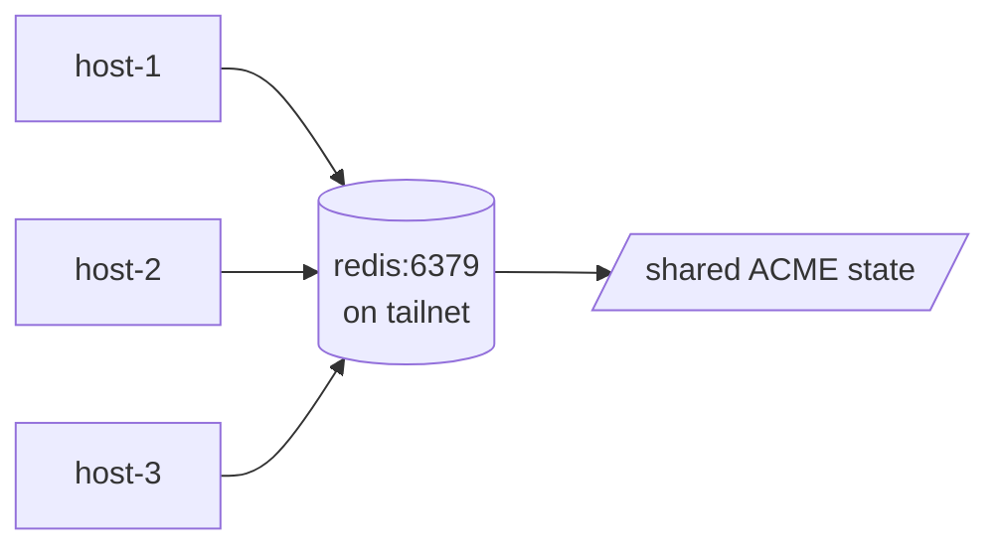

When you run yoink across multiple hosts that serve the same domain, **each host's Caddy independently asks Let's Encrypt for a cert and you hit rate limits within a week**. The fix: share ACME state across all proxies via a small Redis instance reachable on a private network.

If you're using Cloudflare's edge, the simpler answer is [Origin Certificates](/docs/how-to/cloudflare-origin-certs) — no ACME at all. This recipe is for the LE-direct case.

## Architecture



- A **single Redis** instance, deployed by yoink onto one canonical host.
- All proxies use the [`caddy-storage-redis`](https://github.com/pberkel/caddy-storage-redis) plugin to point Caddy's storage at Redis instead of the local `/data` volume.
- **Tailscale** (or any private network) keeps Redis off the public internet — the redis port is published only on the tailnet IP.

The single Redis is a small SPOF, but a tractable one (it's only used for cert issuance/renewal, not request-path traffic). Backups via tailnet-replicated snapshots if you need it.

## Setup

<Steps>

### Bake the plugin into caddy

`caddy-storage-redis` isn't in the base `caddy:2` image. The plugin part is straightforward — `proxy.xcaddy:` does the build on every proxy host:

```yaml
proxy:
  email: ops@example.com
  xcaddy:
    plugins:
      - github.com/pberkel/caddy-storage-redis
```

That gets the storage *module* compiled into the caddy binary on each host. Wiring caddy to actually *use* Redis as its storage backend takes one more step — see the [Wire caddy's storage backend](#wire-caddys-storage-backend) section below.

See [Caddy plugins (xcaddy, no registry)](/docs/how-to/caddy-plugins) for the full xcaddy story (build cost, idempotency, debugging).

### Run Redis as a yoink service

Pin Redis to one host and publish only on the tailnet IP:

```yaml
hosts:
  - { address: prod-1, user: deploy }
  - { address: prod-2, user: deploy }
  - { address: prod-3, user: deploy }

services:
  - name: redis
    image: redis
    tag: "7"
    hosts: [prod-1]                # one canonical host
    networks: [yoink-ingress]      # so the proxies can reach it by name from inside the network
    run:
      port: 6379
      healthcheck_path: null       # Redis doesn't speak HTTP; skip and let yoink TCP-probe
      publish:
        - "100.10.0.1:6379:6379"   # tailnet IP only — adjust to your tailscale assignment
      volumes:
        - "redis-data:/data"
```

The published port on Tailscale's IP makes Redis reachable from `prod-2` and `prod-3` over the tailnet, but **not** from the public internet (Hetzner / your hosting provider's external interface).

### Wire caddy's storage backend

`proxy.xcaddy:` compiles the plugin in. `proxy.config_extra:` hands caddy the top-level `storage` block that tells it to *use* Redis instead of the local `/data` volume:

```yaml
proxy:
  email: ops@example.com
  xcaddy:
    plugins:
      - github.com/pberkel/caddy-storage-redis
  config_extra: |
    {
      "storage": {
        "module": "redis",
        "address": "redis:6379"
      }
    }
```

Yoink deep-merges that JSON into the rendered Caddy config before `/load`-ing it. The `storage` block sits at the top level alongside `admin` and `apps`, which is exactly where Caddy expects it. See the [`config_extra:` reference](/docs/guide/proxy#proxyconfig_extra-block--global-caddy-config-escape-hatch) for merge semantics.

Every proxy host now reads ACME state from the shared Redis instead of its local `/data` volume. The `yoink_caddy_data` named volume becomes empty — but you can leave it; it does no harm.

### Tailscale on every host

For the proxies on `prod-2` and `prod-3` to reach `redis:6379` on `prod-1`'s tailnet IP, every host needs to be on the tailnet. See the [networking guide](/docs/guide/networking) for the setup.

</Steps>

## See also

- [Reverse proxy guide](/docs/guide/proxy)
- [Cloudflare Origin Certificates](/docs/how-to/cloudflare-origin-certs) — simpler path if you're already on Cloudflare's edge.
- [`caddy-storage-redis`](https://github.com/pberkel/caddy-storage-redis) — the upstream plugin.
