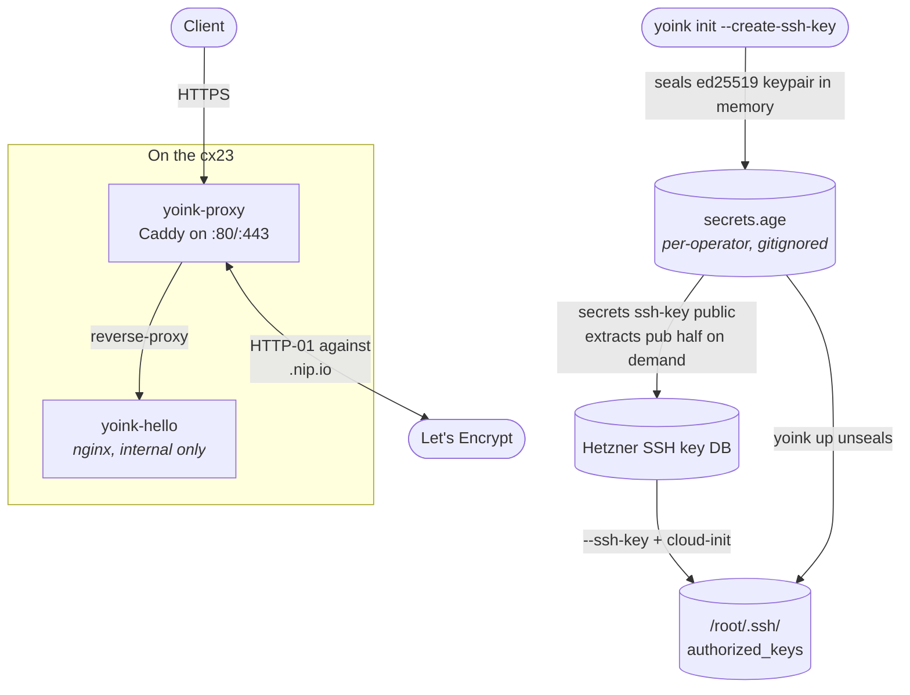

Empty Hetzner project → live HTTPS endpoint in **~90 seconds**, end-to-end. The cheapest x86 EU tier ([cx23](https://www.hetzner.com/cloud) — €3.99/mo, 2 vCPU / 4 GB / 40 GB), a fresh AGE-sealed deploy key, a real Let's Encrypt cert against `<ip>.nip.io`. No domain to register, no DNS records to wire up, no plaintext key material on disk.


**HTTPS without a domain.** `<ip>.nip.io` is wildcard DNS — `anything.1.2.3.4.nip.io` resolves to `1.2.3.4`. It's been on the [Public Suffix List](https://publicsuffix.org/) since 2018, so each operator gets their own Let's Encrypt rate-limit bucket. That's what lets the cert step work on a brand-new IP with zero DNS configuration.


<details>
<summary><strong>The whole recipe as one paste</strong></summary>

For the impatient. Drop the two YAML files described below into `./services/` and `./` respectively, then:

```bash
# one-time
brew install hcloud oddur/yoink/yoink   # yoink ≥ 0.15.0

# init: AGE identity + sealed deploy key + skeleton yoink.yaml
yoink init --create-ssh-key DEPLOY_SSH_KEY --proxy-email you@example.com

# provision a cx23 in nbg1, baked with cloud-init
hcloud context create bt-scratch
hcloud ssh-key create --name yoink-scratch \
  --public-key-from-file <(yoink secrets ssh-key public --name DEPLOY_SSH_KEY)
hcloud server create --name bt-scratch-01 --type cx23 \
  --image ubuntu-24.04 --location nbg1 \
  --ssh-key yoink-scratch \
  --user-data-from-file cloud-init.yaml

# register host with yoink + deploy
IP=$(hcloud server ip bt-scratch-01)
yoink hosts add --address $IP --user root --ssh-key-secret DEPLOY_SSH_KEY
HOST_IP=$IP yoink preflight --wait 90s
HOST_IP=$IP yoink up

# verify
curl https://$IP.nip.io   # → yoink!
```

Stop here if it works. The walkthrough below explains what each step does and why.

</details>

## Architecture



## Prerequisites

```bash
brew install hcloud
brew install oddur/yoink/yoink                               # ≥ 0.15.0
```

A Hetzner Cloud account and an API token with read+write scope. New to Hetzner? Sign up at [accounts.hetzner.com/signUp](https://accounts.hetzner.com/signUp), create a project at [console.hetzner.cloud](https://console.hetzner.cloud), then generate the token under **Security → API Tokens** — paste it at the `hcloud context create` prompt below.

## The two files you'll write by hand

The recipe-specific YAML (the placeholder service + the cloud-init payload) lives in your repo. Drop both into a fresh directory:

```yaml
# services/yoink-hello.yaml — placeholder behind the proxy
services:
  - name: yoink-hello
    image: nginx
    tag: alpine
    networks: [yoink]
    domain:
      - ${HOST_IP:-placeholder}.nip.io
    run:
      port: 80
      replicas: 1
      cmd:
        - sh
        - -c
        - "echo 'yoink!' > /usr/share/nginx/html/index.html && exec nginx -g 'daemon off;'"
      healthcheck_path: /
      healthcheck_timeout: 30s
      options:
        # Loosened for nginx-as-root; see RunOptions reference for prod-shape defaults.
        user: "0:0"
        cap_drop: []
        tmpfs:
          /usr/share/nginx/html: "size=1m,mode=0755"
          /var/cache/nginx: "size=4m,mode=0755"
          /var/run: "size=1m,mode=0755"
```

```yaml
# cloud-init.yaml — host-bootstrap, runs once on first boot
#cloud-config
package_update: true
packages: [ca-certificates, curl]
runcmd:
  - curl -fsSL https://get.docker.com | sh
  - systemctl enable --now docker
  # Pre-pull yoink's healthcheck-probe images so the first deploy doesn't race.
  - docker pull curlimages/curl:8.10.1
  - docker pull busybox:1.37
```

`cloud-init.yaml` is provider-flavored (Hetzner / EC2 / Linode all consume this format slightly differently). It lives in your repo, not in yoink. The service fragment uses [`${VAR:-default}` env-var substitution](/docs/reference/config#environment-variable-substitution) so the file parses cleanly when no host is provisioned yet.

## Walkthrough

{}

### Initialize the project

```bash
yoink init --create-ssh-key DEPLOY_SSH_KEY --proxy-email you@example.com
```

One command does several things in sequence:

- Generates an [AGE identity](/docs/guide/secrets#sealed-secrets-age--the-default) at `~/.config/yoink/keys/<age1…>.key` (skipped if you already have one).
- Generates an ed25519 SSH keypair and seals its private half into a new `secrets.age` under `DEPLOY_SSH_KEY`.
- Writes `yoink.yaml` with: an empty `hosts:` list (populated by `yoink hosts add` after provisioning), an empty `services:` list (populated by your service fragment in step 1b), `proxy.email:` for ACME, and a wide `include:` glob covering both `hosts/*.yaml` and `services/*.yaml`.

The empty `hosts:` and `services:` lists are by design — yoink accepts them at load time so commands run cleanly between init and the first deploy. `yoink up` is the boundary that requires both to be populated. Let's Encrypt rejects emails on `example.com` — use a real address.

### Provision the cx23

```bash
hcloud context create bt-scratch                     # paste API token at prompt
hcloud ssh-key create --name yoink-scratch \
  --public-key-from-file <(yoink secrets ssh-key public --name DEPLOY_SSH_KEY)
hcloud server create --name bt-scratch-01 --type cx23 \
  --image ubuntu-24.04 --location nbg1 \
  --ssh-key yoink-scratch \
  --user-data-from-file cloud-init.yaml
```

`yoink secrets ssh-key public` derives the OpenSSH-format public key from the sealed private — no plaintext PEM ever touches `/tmp`. The `<(…)` process substitution feeds it to hcloud as a file without an intermediate write.

`cx23` is `nbg1`-only at the time of writing — `hcloud server-type describe cx23` is the source of truth. ARM `cax11` is €4.49/mo (Helsinki / Falkenstein) for multi-arch workloads.

### Register the freshly-provisioned host with yoink

```bash
IP=$(hcloud server ip bt-scratch-01)
yoink hosts add --address $IP --user root --ssh-key-secret DEPLOY_SSH_KEY
```

`yoink hosts add` writes a fragment under `hosts/<derived>.yaml` and re-parses the fleet to catch address collisions. The fragment is the sole source of truth for the new host — the operator's `yoink.yaml` is never edited in place.

### Deploy

```bash
HOST_IP=$IP yoink preflight --wait 90s   # waits for cloud-init to finish installing Docker
HOST_IP=$IP yoink up                      # ACME runs inline; ~5–15s for the cert
```

`yoink up` unseals the SSH key, brings up the bundled Caddy proxy, and obtains a real Let's Encrypt cert via HTTP-01 against `<ip>.nip.io`. `HOST_IP=$IP` is what the service fragment's `${HOST_IP:-placeholder}.nip.io` resolves against. Set it once for both commands.

### You're done. Verify:

```bash
curl https://$IP.nip.io
# → yoink!
```


**Bonus.** Inspect the cert to convince yourself it's a real Let's Encrypt leaf, not a self-signed placeholder:

```bash
echo | openssl s_client -connect $IP.nip.io:443 -servername $IP.nip.io 2>/dev/null \
  | openssl x509 -noout -issuer -subject -dates
# issuer=C=US, O=Let's Encrypt, CN=E8
```


{}

## Cleanup

```bash
hcloud server delete bt-scratch-01
yoink hosts remove $(echo $IP | tr ':.' '-')         # drop the fragment
```

Optional, only if this was a true one-off:

```bash
hcloud ssh-key delete yoink-scratch
rm secrets.age yoink.yaml
```

Hetzner billing is hourly capped at the monthly price; `hcloud server list` is worth bookmarking.

## Troubleshooting

| Symptom | Fix |
|---|---|
| `Permission denied (publickey)` on `yoink up` | Hetzner reused an IP and your `~/.ssh/known_hosts` has the old host key (`ssh-keygen -R $IP`); or the sealed key in `secrets.age` doesn't match what's in the Hetzner DB (regenerate with `yoink secrets ssh-key generate --seal-as DEPLOY_SSH_KEY` and re-upload). |
| `cannot connect to docker daemon` | Cloud-init still installing Docker. Bump `yoink preflight --wait 120s`. |
| Cert error on `curl https://…` | ACME hasn't finished. `ssh root@$IP "docker logs yoink-proxy-… 2>&1 \| grep -iE 'acme\|cert'"`. |
| `nip.io` doesn't resolve | Captive-portal DNS. `curl --resolve $IP.nip.io:443:$IP https://$IP.nip.io`. |
| `no matching age identity` | Your laptop's AGE identity isn't in `secrets.recipients:`. Add it; have someone with an existing identity re-seal via `yoink secrets edit`. |

## Next steps

- **Bring your own app** — drop the `cmd:` and the loose `options:` from `services/yoink-hello.yaml`; point `image:`/`tag:` at your image. The Caddy + ACME wiring stays the same.
- **Build the image on your laptop** instead of pulling from a registry. Add a `build:` block and run `yoink up --build`. See [Deploy modes](/docs/guide/deploy-modes).
- **Add a third-party service** like postgres, redis, or restic backups via [`yoink add`](/docs/guide/templates) — one command renders a vetted service fragment alongside your config. The [TanStack stack recipe](/docs/recipes/tanstack-stack) walks the full pattern; the [restic-backups recipe](/docs/recipes/volume-backups) shows the secrets-and-schedule shape.
- **Move from `<ip>.nip.io` to a real hostname** — replace the `domain:` value, point an A record at `$IP`. Nothing else changes.
- **Tighten TLS** with [Cloudflare Origin Certificates + origin-pull mTLS](/docs/recipes/cloudflare-origin-certs) once you have a real domain.
- **Scale to multiple hosts** sharing one ACME state pool: [Multi-host Let's Encrypt with Redis](/docs/recipes/multi-host-redis-storage).
